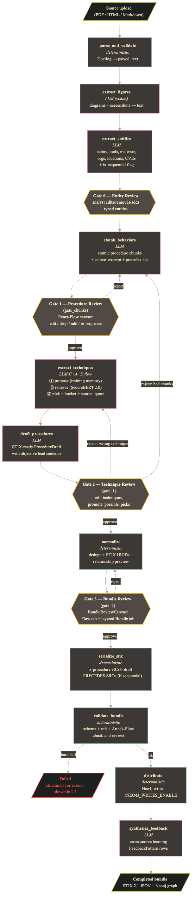

# Architecture

The reference: files, state, routing, and the contracts that tests pin.
For the plain-language walk-through read [HOW_IT_WORKS.md](HOW_IT_WORKS.md)
first; for the learning loop, [FEEDBACK_FLYWHEEL.md](FEEDBACK_FLYWHEEL.md);
for the output object, [X_PROCEDURE.md](X_PROCEDURE.md); for every
dependency, model and external service, [SBOM.md](SBOM.md).



Re-render the diagram from its source with
`npx -p @mermaid-js/mermaid-cli mmdc -i docs/pipeline-flow.mmd -o docs/pipeline-flow.png -b transparent`.

## The two files everything pivots on

- [`backend/app/graph/state.py`](../backend/app/graph/state.py) — `PipelineState`,
  one `TypedDict` every node reads from and writes to, plus `PipelineStatus`
  and the gate helpers. Adding a field here is the first step of any pipeline
  change.
- [`backend/app/graph/pipeline.py`](../backend/app/graph/pipeline.py) — the graph:
  sixteen `add_node` calls, the sequential edges, the six conditional
  routers, and `compile_pipeline()`, which `main.py` calls at startup with
  `interrupt_before` set to the four gate nodes. Its module docstring is the
  map; a test pins it to the registered node set.

## Node taxonomy

Three kinds of node, kept apart on purpose.

**Deterministic** (`backend/app/nodes/deterministic/`): `parse_and_validate`,
`normalize`, `serialize_stix`, `validate_bundle`, `distribute`. No model
call.

**LLM** (`backend/app/nodes/llm/`): `extract_figures` (vision),
`classify_sections`, `extract_entities`, `chunk_behaviors`,
`extract_techniques` (propose → retrieve → validate → pick),
`draft_procedures`, `synthesize_feedback`. All go through
`llm_adapter.call_llm`, which is provider-neutral; vendor code lives in
`backend/app/nodes/llm/providers/` behind an `LLMProvider` protocol, one
module per vendor (`anthropic`, `openai`), selected by `settings.llm_provider`.
The provider owns wire format only. The response cache, Pydantic validation
with bounded retry, the refusal retry and token accounting live in the
adapter and are not duplicated per provider. A provider must be able to
force a named tool call and accept image input.

**Gates** (`backend/app/nodes/gates.py`): `gate_0` (entities),
`gate_chunks` (chunks, which are the procedures), `gate_1` (technique
mappings on the drafts), `gate_2` (the bundle). The graph pauses *before*
each via `interrupt_before`; the API writes the analyst's decisions to state
with `graph.update_state(...)`; the gate node then runs and applies them.

The backend node names and the user-facing numbering differ, deliberately:

| UI | Node | Reviews | A reject re-runs |
|---|---|---|---|
| Gate 0 | `gate_0` | entities and their roles | — (edits apply in place) |
| Gate 1 | `gate_chunks` | chunks, order, operators, conditions | `chunk_behaviors` |
| Gate 2 | `gate_1` | drafts and their technique mappings | `chunk_behaviors` on a bad-boundary reason, else `extract_techniques` |
| Gate 3 | `gate_2` | the bundle's relationships | `normalize` |

Renaming the nodes would cascade across state fields and around fifty test
sites for no behavioural gain; the UI layer (`frontend/src/lib/gates.js`)
owns the numbering.

## Per-gate enable and mode

`state["gates_enabled"]` is a dict keyed `entities` / `chunks` / `procedures`
/ `bundle`. Read it with `is_gate_enabled(state, key)`, never directly (it
tolerates legacy boolean checkpoints). A gate whose key is `False`
auto-approves. Because `interrupt_before` is static, the runner in
`backend/app/api/routes/pipeline.py` (`stream_with_sync`) loops: after each
stream stops at an interrupt it checks whether that gate is disabled and, if
so, resumes so the gate node executes and self-skips. Mixed configurations
work without an analyst prompt.

`state["gate_modes"]` is a separate dict: `review` (human, default),
`assist` (AI recommends, human decides), `auto` (AI decides, unattended).
Read it with `gate_mode(state, key)`. A gate whose reviewer has not shipped
falls through to human review whatever its mode says, enforced by the
`_REVIEWING_STATUS` membership test in the runner, not just hidden in the UI.

## Conditional routing

Only at gates and hard-fail guards:

- after `parse_and_validate`: status `failed` → END (a missing or unparseable
  file must not flow on as empty text and surface at Gate 0 with nothing to
  review); otherwise → `extract_figures`
- after `chunk_behaviors`: status `failed` → END (zero chunks or a validation
  failure must not reach a gate that would auto-approve an empty list);
  otherwise → `gate_chunks`
- after `gate_chunks`: reject → `chunk_behaviors`; otherwise → `extract_techniques`
- after `gate_1`: `BAD_CHUNK_BOUNDARY` → `chunk_behaviors`; any other
  rejection → `extract_techniques`; otherwise → `normalize`. Bad chunking
  wins because wrong chunks make the mapping wrong too.
- after `gate_2`: approved → `serialize_stix`; rejected → `normalize`
- after `validate_bundle`: hard-fail → END, source marked failed, `distribute`
  never runs; otherwise → `distribute` → `synthesize_feedback` → END

## Status

`PipelineStatus` is the enum the Kanban board, the card, the stats bar and
the WebSocket subscription all derive from. On the frontend it is one table,
`frontend/src/lib/pipelineStatus.js`; `tests/test_contracts.py` checks the
table against the enum in both directions. `RESUMING_FROM_GATE_*` is a
transient status the gate node writes after applying decisions so the card
stays in its column while the pipeline restarts; the downstream node
overwrites it almost at once. Do not "fix" it.

## Writing state at a gate

Any API-driven `update_state` at a paused gate must pass
`as_node=<the gate's immediate predecessor>`: `chunk_behaviors` for
`gate_chunks`, `draft_procedures` for `gate_1`, `normalize` for `gate_2`.
Tagging the gate itself makes LangGraph treat the input as the gate's output
and skip it; tagging two nodes upstream re-triggers the nodes between. The
registry in `backend/app/api/routes/_gate_registry.py` carries the mapping.

## The AI gate reviewer

`backend/app/services/reviewer/`: `runner` (the turn loop),
`gate_reviewers` (per-gate tool schema, prompt, and what the reviewer is
shown), `models` (strict Pydantic per gate), `store` (transcript and
outcomes), `outcomes` (diff recommended vs submitted), `agreement`
(cross-source aggregation). The reviewer reads the source once and carries
its own reasoning gate to gate.

- Every quoted piece of evidence is checked against the source
  (`services/grounding.py`); an unsupported quote forces `low` confidence,
  which excludes it from bulk-accept.
- Each gate submit diffs the recommendation against what the analyst did onto
  `ReviewerRecommendation.outcome`. `GET /api/reviewer/agreement` pools those;
  the Reviewer tab renders them per gate and confidence tier. Rates are
  pooled, never averaged; an empty gate reads `None`, not 0%; rows the agent
  applied itself (`auto` mode) are excluded, because they record the reviewer
  agreeing with itself.
- Adding a gate reviewer means adding, in one change: the reviewer, its
  `PipelineStatus` value, its `_REVIEWING_STATUS` entry, its row in the status
  table, and its outcome differ. A test asserts every reviewer has a differ.

## Chunks and the data-contract trio

A chunk field lives in three places that must agree: the tool schema the
model is told to emit (`chunking.py`), the Pydantic model that validates it
(`tool_models.py`), and the `Chunk` dataclass in `state.py`. A field added to
two of them fails on the first real model call.

Each chunk carries a verbatim `source_excerpt` with byte offsets
(`source_span`) into `parsed_text`, forward edges (`precedes_ids`, inverted
from the model's emit-time `predecessor_indices`), and branch/converge
flags. The document goes to the model in one call; there is no windowed
fallback, a document too large for one call fails loudly. When the source is not sequential
(`state["is_sequential"]`, decided at entity extraction and overridable per
source), predecessor links are left empty unless the text states an order,
the orphan-link backstop is skipped, and the serializer emits no `PRECEDES`
relationships.

## Technique extraction

Per chunk: **propose** (model, no catalogue shown) → **retrieve** (top-30
from the catalogue; `settings.technique_retriever` is `embedding` by default,
`token_overlap` as the no-download alternative) → **validate and union**
(`AttackData.validate_technique_ids` drops hallucinated IDs, redirects
revoked ones, drops deprecated) → **brand expansion**
(`services/technique_pattern_brands.py`) → **pick** (model, from the unified
pool, with `confidence_bucket`, a verbatim `source_quote`, and a rationale)
→ **quote cap** (a quote not present in the chunk demotes the pick to
`possible`) → **bucket split** (`definite` and `probable` feed the bundle;
`possible` goes to the Gate 2 review lane). Denylisted technique IDs are
held in that lane too, flagged, and promotable per source.

The ATT&CK data is parsed from the STIX bundle at `settings.attack_stix_path`
with the standard library (`services/attack_data.py`). Do not introduce
`mitreattack-python` or `attack-stix-lookup`; both conflict with Docling's
dependencies.

## Serialization and validation

`serialize_stix` builds a self-contained bundle: `x-procedure` objects,
the ATT&CK objects they reference, actors, malware, tools, identities,
observables as STIX Cyber Observables (never Indicators), the
`extension-definition` objects the custom types declare (ours for
`x-procedure`, CTID's for Attack Flow; `extension_definitions.py`), a report
listing the content, and the relationships. Naming is
`[Verb] [Object] via [Tool]` with no actor in the name. `x_fingerprint` is a
hash of sorted techniques, platforms and tactics, computed in one place
(`utils/fingerprint.py`) that both the normalizer and the validator use.

`validate_bundle` is all-or-nothing: the vendored JSON Schema for every
object type and `x_procedure_v3.json` for procedures, reference integrity,
and Attack Flow integrity. Recoverable issues are repaired and recorded in
`bundle_corrections`, which the source card shows. Hard failures route to
END.

## Distribution

Writes are gated by `NEO4J_WRITES_ENABLED` (default `false`). All Cypher
lives in `services/neo4j.py` and `nodes/deterministic/distribution.py`. The
catalogue is never written: `CATALOGUE_OWNED_TYPES` skips node writes for
ATT&CK object types, and edges between two catalogue objects are skipped.
Every node the pipeline writes carries `x_ingested_by = 'pipeline'`, and
`(:Report)-[:DESCRIBES]->(object)` records provenance; that edge set is what
`backend/scripts/undo_graph_source.py` removes. The procedure-to-technique
`uses` relationship is written to the graph as `IMPLEMENTS_TECHNIQUE` so it
never blurs into ATT&CK's own `USES` edges; the bundle stays standard.

## The LLM cache key

`llm_adapter._build_cache_key` hashes the full request. Two shims keep old
keys reachable: the `provider` key is omitted for Anthropic, and image
blocks are canonicalised to their original shape. Changing either
invalidates every cached response; bump `LLM_CACHE_VERSION` in the same
change. `backend/tests/test_llm_providers.py` pins the format. The system
prompt is part of the key, so a prompt edit invalidates its own cache
without any bump.

## Repository layout

```
backend/
  app/
    graph/           state.py, pipeline.py, checkpointer.py
    nodes/
      deterministic/ parse, normalize, serialize, validate_bundle, distribute,
                     attack_operators, attack_conditions
      llm/           entity_extraction, figure_extraction, chunking,
                     technique_extraction, drafting, feedback_synthesis,
                     llm_adapter, tool_models, providers/
      gates.py       gate_0, gate_chunks, gate_1, gate_2
    api/routes/      source_queue, pipeline, gates, bundles, feedback_patterns,
                     reviewer, techniques, ws
    services/        neo4j, queue, bundle_store, attack_data, technique_retriever,
                     technique_pattern_brands, feedback_patterns, feedback_examples,
                     pattern_embedding, grounding, figure_stash, reviewer/
    schemas/         x_procedure_v3.json, the vendored STIX schemas, api.py
    utils/           fingerprint, text, refang
  scripts/           operator tools: graph undo, feedback backfills, golden capture
  migrations/        README only; the schema is created at API startup
  tests/             backend-internal pytest suite
frontend/src/
  components/        KanbanBoard, SourceCard, AddSourceModal, GateReviewPanel,
                     Gate0Review, ChunkReviewCanvas, Gate1Review,
                     BundleReviewCanvas, ExplorerView, BundleGraph, BundleFlowView,
                     FeedbackPatternsView, ReviewerAgreementView
  lib/               gates, pipelineStatus, glossary, graphLayout, bundleResolution
scripts/             fetch_attack.sh, load_attack.py
data/                attack/ (fetched), samples/ (one public-domain advisory)
tests/               repo-root integration and end-to-end suite
```

## Tests

Two pytest configs: `pytest.ini` at the root (`tests/`) and
`backend/pytest.ini` (`backend/tests/`). Both put `backend/` on the import path.
`tests/conftest.py` provides `base_state`, `sample_entities` and
`sample_drafts`; reuse them. Both conftests pin Neo4j writes off and the
retriever to `token_overlap`, so no test downloads a model or writes to a
graph. The end-to-end tests run the real graph against a real Postgres and
skip when it is not reachable; run with `-rs` so the skip is visible.
