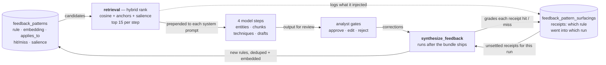

# The feedback flywheel

**How one analyst correction becomes a rule that survives, gets graded on
whether it actually helped, and can be promoted from a suggestion into an
enforced guardrail.**

This document explains the learning loop for someone who has not opened the
code. [HOW_IT_WORKS.md](HOW_IT_WORKS.md) covers the pipeline the loop sits in;
[ARCHITECTURE.md](ARCHITECTURE.md) is the reference with file paths.

## Contents

1. [The problem it solves](#1-the-problem-it-solves)
2. [The loop, end to end](#2-the-loop-end-to-end)
3. [Two channels: rules and examples](#3-two-channels-rules-and-examples)
4. [Retrieval: relevance, not a category dump](#4-retrieval-relevance-not-a-category-dump)
5. [Grading the memory: hit, miss, salience](#5-grading-the-memory-hit-miss-salience)
6. [Three strengths of memory](#6-three-strengths-of-memory)
7. [The analyst's controls](#7-the-analysts-controls)
8. [Decisions worth stealing](#8-decisions-worth-stealing)
9. [Failure modes we actually hit](#9-failure-modes-we-actually-hit)

## 1. The problem it solves

In the simplest terms, the feedback flywheel is how the pipeline learns from
the analyst. The pipeline reads a threat-intelligence report and produces a
structured description of what the attacker did, with a human analyst
checking the output at four checkpoints called gates and approving, editing,
or rejecting what the model produced. The flywheel takes each of those
corrections and turns it into something the pipeline remembers, so the same
mistake is not made again on the next report, and so the analyst is not
asked to fix the same thing over and over.

It does this in three steps. First, when a run finishes, it compares what the
model produced against what the analyst kept, and writes the difference down
as a short rule in plain language, such as "a contact address printed in a
vendor's report letterhead belongs to the defender, not the attacker."
Second, when the next report comes in, it looks through the stored rules and
hands the model only the handful that fit that report, the way a colleague
would mention the one or two things worth knowing rather than reciting every
lesson they have ever learned. Third, after that run is reviewed, it checks
whether each rule it handed over actually stopped the analyst from making the
same correction again. Rules that keep helping are shown more often; rules
that do not fade out.

The obvious alternative, editing the model's instructions by hand each time,
does not scale. The corrections are numerous, narrow, and mostly irrelevant
to each other: a rule about report letterheads has nothing to teach a
ransomware write-up, and instructions stuffed with every rule ever learned
get worse faster than they get better. Storing the rules, choosing the
relevant few, and grading them is what keeps the memory useful as it grows.

> **The core claim.** Learning from human feedback does not require
> retraining a model. It requires a store of corrections, a retriever that
> picks the relevant few, and a scoreboard that tells you which ones are
> earning their place in the prompt. The third part is the one most
> implementations skip, and it is the one that keeps the store from turning
> into landfill.

## 2. The loop, end to end

One turn of the flywheel is one pipeline run. Four model steps read from
memory on the way in; the analyst's corrections write to memory on the way
out, along two separate paths.



**The same correction stream feeds two different writes.** One path asks
"what new rule should we learn from this?" and adds a row. The other asks "of
the rules we already injected into this run's prompts, which failed to
prevent the correction anyway?" and grades them. The second path is what
stops the store from growing without bound, and it is only possible because
the retrieval step wrote down what it surfaced (the dotted edge) *before* the
run happened.

### Stage 1 — Capture the correction, durably

Each gate writes every non-approve decision to an append-only **correction
ledger** in the run's state: the entity that was rejected and the analyst's
stated reason, the chunk that was dropped, the technique that was swapped for
another.

The ledger is append-only for a specific reason. Rejecting at a gate often
sends the pipeline *backwards* to re-run an earlier step, and the re-run
overwrites the decision fields. A plain "current decisions" field is
last-write-wins, so the rejection that triggered the loop, the single most
informative correction in the whole run, would be gone by the time anyone
looked. That signal was lost this way before the ledgers existed.

### Stage 2 — Synthesise rules from the diff

After the run finishes and the bundle has shipped, one more model call
receives a digest of every gap between what the model produced and what the
analyst accepted. Its job is to write **generalizable rules**, and the prompt
is explicit about the difference, with worked examples:

- **Bad:** "`info@cert.example` was rejected as an indicator."
- **Good:** "Email addresses extracted from figures classified as letterheads
  or government CERT contact cards are defender contact info, not adversary
  indicators."

Each rule gets a category from a fixed sixteen-value taxonomy, free-form
evidence for audit, a self-assessed confidence, and **structured retrieval
keys** (`applies_to`: which technique IDs, entity types, tactics and kind of
source it concerns). The prompt tells the model to prefer few high-quality
rules and to return an empty list when there is no real pattern. Anything
under 0.5 confidence is dropped before it reaches the database. This step
runs after delivery, so a failure here can never block a bundle.

### Stage 3 — Store with two-tier deduplication

On write, the rule is embedded with the same security-domain model the
pipeline already uses for technique retrieval, so there is no new
infrastructure, and matched against what is already stored:

1. **Exact** text match within the same category: bump an occurrence counter.
2. **Semantic:** cosine similarity at or above 0.55 **and** token overlap at
   or above 0.20 against same-category rules: merge as a recurrence. Both
   bars, deliberately.
3. Only when both miss does a new row appear.

The semantic tier matters because the synthesiser paraphrases. Exact-string
dedup alone gives you six rows saying the same thing in different word order,
each with an occurrence count of one, and occurrence count is a signal the
ranker depends on.

The two bars are calibrated to the genre. The embedding model returns about
0.91 for two paraphrases of one threat *behavior*, but these rules are
*instructional* text, where its scale compresses: the most similar pair of
real rules scored about 0.70, so a 0.90 bar was unreachable by construction.
Lowering it alone does not work either, because a true duplicate and a
genuinely distinct pair both scored about 0.58. Cosine cannot separate those,
so token overlap is required alongside it; on hand-labeled pairs the
duplicates ran at 0.228 overlap or higher and the distinct pairs at 0.164 or
lower. The conjunction is biased toward *not* merging, because a false merge
silently deletes one rule's guidance while a missed merge only leaves a
near-duplicate. **Never carry a similarity threshold across text genres**;
measure the model's range on the genre first.

### Stage 4 — Retrieve what is relevant to *this* report

Each of the four model steps declares the categories it can act on:

| Step | Categories it asks for |
|---|---|
| entity extraction | `defender_ioc`, `brand_as_malware`, `false_positive_entity`, `mis_attribution` |
| chunking | `over_chunked`, `under_chunked`, `missing_procedure`, `wrong_predecessor`, `parallel_capability_misordered`, `thin_initial_access`, `artifact_loss` |
| technique mapping | `missing_tactic`, `wrong_technique`, `thin_initial_access`, `orphan_ioc` |
| drafting | `artifact_loss`, `orphan_ioc`, `wrong_relationship`, `missing_procedure`, `thin_initial_access` |

Within those categories, rules are ranked against an embedded description of
the current report and the top fifteen are prepended to the system prompt.
Every rule that gets injected is written to the surfacing ledger, tagged with
the run and the step that used it. That row is the receipt the scoring stage
settles later.

### Stage 5 — Settle the receipts: hit or miss

Back in the post-run synthesiser, before it writes anything new, it reads the
unscored surfacings for this run. For each rule that was injected, it asks:
did the analyst make a correction *of the kind this rule warns about* anyway?
Matching is by shared structured key (same technique ID or entity type) or by
embedding similarity at or above 0.55 between the rule and the correction.

- Correction recurred: **miss**.
- A human reviewed that gate and corrected nothing: **hit**.
- Nobody with judgment looked: **unscored**.

Only hits and misses move the counters, and a hit requires a human to have
actually looked: the gate must have been enabled and not running unattended.
An absent correction is also what you get when the gate was disabled, when
the AI reviewer ran it alone, or when the rule was irrelevant to the report,
and counting those as hits would make the hit rate measure the *absence of
review*. Everything else is recorded as unscored, explicitly, so "we looked
and there was no evidence" stays distinguishable from "we never got there".
The honest consequence is that the scoreboard reads zero until humans have
reviewed real sources. That is the same shape as the reviewer agreement
readout on the Reviewer tab, for the same reason.

## 3. Two channels: rules and examples

Everything above describes **rules**: a model's generalization *about* a
correction. There is a second channel, and when the two disagree it is the
one to prefer.

A **corrected example** is the correction itself: what the pipeline produced,
what the analyst made of it, and their own words. Examples are recorded by the
same post-run step, before the synthesis call, so the record does not depend
on the model call succeeding.

The generalization step is where the measured errors are. A hand review of
the synthesised rules dropped roughly one in seven as wrong, and a
calibration run found that most of the rules that fired against real output
had never once agreed with the analyst. An example cannot be wrong in that
way; it can only be *irrelevant*. And an example can teach an omission, such
as a technique the model failed to propose or a chunk it failed to see, which
a rule phrased as a check cannot.

Examples use the same retrieval machinery (embedding similarity plus lexical
anchors, no salience, because an example is a record and "was it right" is
not a question about it), and each of the four model steps fetches them
**separately** from the rules, with a much smaller top-N because a
demonstration costs far more prompt space than a one-line rule.

**Only human corrections are recorded.** The example writer skips any gate
that was disabled or ran unattended, because every one of the first batch of
synthesised rules turned out to have come from an AI reviewer agreeing with
itself.

## 4. Retrieval: relevance, not a category dump

The first version of this system was a category dump: each step fetched
*every* active rule in its categories, ordered by how often each had
recurred. It worked at ten rules and became noise at fifty. A ransomware
incident report would get rules about AI-assisted phishing injected into its
prompt, because both are `wrong_technique`.

The fix is a hybrid score: semantic similarity plus exact-match boosts on the
structured keys, computed in-process over a small candidate set. **There is
no vector database.** A SQL query narrows to at most eighty candidates by
category, status and recency; cosine similarity is a dot product over a few
dozen stored float arrays. At this scale that is cheaper than a network hop.

| Term | Weight | Why it is worth that much |
|---|---|---|
| Cosine similarity between the rule and a description of this report | roughly 0.2 to 0.7 | The base signal. Catches topical relevance that no keyword shares. |
| Shared technique IDs in `applies_to` | + 0.50 | Strongest evidence available: this run is actually mapping that technique. Sized to dominate a mediocre cosine. |
| Shared CVE or tool keyword anchor | + 0.30 | Exact lexical hits the embedding compresses away, such as a single CVE number in a long report. |
| Shared entity type | + 0.20 | Weak but real narrowing. |
| Shared tactic | + 0.20 | Same. |
| Salience (earned-usefulness score) | × 0.15 | Breaks ties, and because scores bunch tightly at the cut line it changes which rules are injected more often than its size suggests. |

Ties break on occurrence count, then recency. A rule whose embedding failed
to compute still ranks, on the lexical terms alone, rather than being
silently dropped.

Two things to know about this table. The structured-key terms can only fire
once the state carries the keys: at entity extraction nothing has been
extracted yet, so only cosine, keyword anchors and salience are live there.
And the cosine term measured weakly against the system's own structured keys
as labels, because a one-sentence rule is being matched against thousands of
characters of concatenated report text. Both are known limits of the current
scoring rather than bugs; the weighted sum was kept over rank fusion because
with a few dozen candidates the actual magnitudes carry information that ranks
throw away.

The formatted prompt block is cached for sixty seconds, because all four
steps in a run retrieve within seconds of each other. The cache key is a
fingerprint of the report itself (a hash of its title, the head of its text,
its entity values and the technique IDs in play), stable across a single
run's steps and distinct across reports. Keying on the category set alone
would serve the *first* report's relevant rules to every report that follows.

## 5. Grading the memory: hit, miss, salience

Salience answers "has this rule earned its slot in the prompt?" Three factors
multiply:

```
hit_rate = (hit + 2) / (hit + miss + 2 + 1)   # a mild "assume useful" prior
recency  = 0.5 ** (age_days / 45)              # half-life in days
occ_w    = log(1 + occurrence_count)           # recurring rules count for more

salience = hit_rate * recency * occ_w
```

The prior is doing real work. With a raw hit rate, a rule surfaced once and
scoring one hit reads as 100% reliable and outranks a rule that has held
thirty times out of forty. Two phantom hits and one phantom miss pull small
samples toward the middle until they have earned an opinion, the same
shrinkage that keeps a product with one five-star review off the top of a
bestseller list. A brand-new rule starts at roughly 0.67 rather than 0 or 1,
so it gets a fair chance to be surfaced before the loop has any signal on it.

> **A miss does not mean the rule is wrong.** It means the rule was relevant,
> it was retrieved correctly, and the model ignored it anyway. That is a
> signal the rule is *ineffective as phrased*, and the right response is to
> rewrite or promote it, not delete it. The obvious reading of `miss_count:
> 12` is "throw this away", and acting on that reading would delete the rules
> most in need of a human's attention.

A periodic sweep recomputes salience for every rule and archives the ones
that are both below a floor and stale beyond ninety days. Archival is
reversible from the Feedback tab. The recency floor is the hard gate;
salience only lets a demonstrably unhelpful rule leave early.

## 6. Three strengths of memory

A rule surfaced into a prompt is a suggestion. Models ignore suggestions:
roughly five to fifteen percent of the time in this pipeline's experience,
even on rules phrased as hard requirements. So an analyst can escalate a rule
to one of two stronger forms, and the difference between them is *where in
the run they intervene*.

| Status | Where it intervenes | Acts on | Ignorable? |
|---|---|---|---|
| `active` (the default) | Ranked pool; may be cut. Competes for fifteen slots; ages out at ninety days. | The prompt | Yes |
| `promoted_to_prompt` (pinned) | Always injected. Exempt from the top-N cut and the age cutoff. Up to twenty-five pinned rules per category. | The prompt | Yes |
| `promoted_to_denylist` (with concrete terms) | Deterministic filter, **after** the model. Plain code, no model in the path. | The model's **output** | No |

**Only the bottom row is enforcement.** The first two differ in retrieval
treatment but both end at the same place: advice inside a prompt the model
may disregard. The denylist moves the intervention *past* the model, into
ordinary code that filters its output, which is the only version a model
cannot argue with. Promotion is deliberately a human act.

**Pinning.** A pinned rule is always injected for its category, exempt from
the top-fifteen cut and from the age cutoff, and rendered under its own
heading, `PERMANENT RULES (analyst-confirmed — always apply)`, with the
occurrence tally stripped so it reads as a standing rule rather than a
tallied observation. The age exemption is the subtle part: a pinned rule that
*works* stops generating corrections, so its last-seen date stops advancing,
and a recency cutoff would quietly expire it for the crime of succeeding.
Pinned rules are still scored hit or miss; a permanent rule that keeps getting
re-corrected is telling you its phrasing needs work.

**Denylisting.** Promoting to denylist requires the analyst to confirm
**concrete terms**, literal values and technique IDs, pre-filled from the
rule's evidence and editable before saving. Those terms become a
deterministic filter: matching entities are tagged and auto-removed at the
entity gate; denylisted technique IDs are held out of the bundle. The rule
text stays as documentation of *why*. Two properties keep this from becoming
a footgun. A blocked entity still appears at the gate, pre-set to remove with
a red badge and the reason, and the analyst can flip it back for that source.
A blocked technique is demoted into the review lane, not deleted, so a source
where it is genuinely correct can be rescued with one click. A global rule
that silently over-reaches on the minority case is worse than no rule.

## 7. The analyst's controls

Everything in this document is operated from the **Feedback** tab.

- **Captured this run.** The top panel shows raw corrections on sources that
  are still running, the moment they are submitted, so an analyst sees
  immediate proof that a reject or edit landed. Synthesised rules only appear
  once a run finishes.
- **The rule list.** Rules are listed most useful first, each with its
  category, occurrence count, hit and miss counts, and a salience bar.
- **Promote.** Two options: *prompt* pins the rule; *denylist* opens a form
  pre-filled with the concrete terms, which the analyst confirms or edits
  before it saves.
- **Dismiss** stops a rule being injected; the row is kept for the record.
- **Edit** changes a rule's text, category or keys; a text change is
  re-embedded so retrieval sees the new wording.
- **The salience slider** hides rules below a minimum. A rule that has never
  been scored has no salience yet, so raising the slider above zero hides
  it; the tooltip on the slider says so.

## 8. Decisions worth stealing

| Choice | Rationale |
|---|---|
| Discrete rows, never a rewritten prompt blob | Rewriting one accumulated instruction block erodes detail every pass. Independent rows can be added, ranked, retired and audited one at a time. |
| Every step is best-effort | Embedding fails: lexical-only ranking. Database unreachable: empty addendum. Synthesiser errors: logged, run still completes. Prompt guidance is not correctness and must never be able to fail a job. |
| Rules live apart from the run they came from | Their own table, not the per-run state. The point is the cross-report query; rules outlive deleted sources; IDs are plain UUIDs, not foreign keys, so either side can be deleted alone. |
| Reuse the embedding model you already have | The pipeline already loads one for technique retrieval; the flywheel borrows the handle. Zero new infrastructure was the condition for shipping. |
| Category scoping is per-consumer, declared at the call site | Each step names the categories it can act on. A chunking rule cannot leak into the technique prompt. Cheap, deterministic pre-filtering that no amount of semantic ranking replaces. |
| The write step self-assesses confidence, and you filter on it | Below 0.5 never reaches the database. Asking the synthesiser to be conservative *and* enforcing it at the persist boundary beats either half alone. |
| Pair every prompt rule with a deterministic backstop | The prompt teaches intent, code catches the residual failure, and the backstop logs a warning so drift is observable. |

## 9. Failure modes we actually hit

Every one of these is a general shape, not a quirk of this codebase.

1. **The cache key that erased relevance.** Keying the retrieval cache on the
   category set meant the first report's rules were served to every report
   for the next sixty seconds. *Key on a fingerprint of the input.*
2. **Last-write-wins state ate the best signal.** A gate rejection sends the
   pipeline backwards; the re-run overwrote the decision field; the rejection
   that caused the loop was gone by synthesis time. *If your feedback can
   trigger a retry, the retry will overwrite the feedback unless you make it
   append-only.*
3. **Machine-generated corrections contaminating the loop.** Denylist
   auto-removals looked exactly like analyst removals in the state, so they
   fed back into synthesis: the system learning from its own enforcement.
   *Tag the origin of every correction and filter out your own.*
4. **The UI defeating the enforcement.** The entity gate submitted a decision
   for *every* entity, defaulting to approve, so the backend's "no decision
   means remove it" branch never fired and the denylist did nothing whenever
   the gate was enabled. *Test enforcement through the real client path.*
5. **Over-broad pre-fill on a one-click action.** Denylist suggestions once
   harvested loosely-named evidence keys and could offer to block
   "PowerShell". *Scope the suggestions for any destructive convenience
   tighter than feels necessary.*
6. **Two written forms of one value drifting apart.** Threat intel is often
   written defanged (`evil[.]com`); denylist terms entered that way never
   matched the normalized entity values. *Normalize at both the write and the
   query.*
7. **Scoring a followed instruction as a failure.** The miss detector once
   folded the analyst's *full final* technique list into the match text,
   including the picks they kept, so a rule whose advice was followed scored
   a miss. *Only ever score against what actually changed.*
8. **A hit rate that measured the absence of review.** "No matching
   correction" once counted as a hit, including on gates nobody looked at,
   and the readout sat at 84% on a corpus with no human corrections in it.
   *A guardrail against a bad default cannot be a number the same defect
   inflates.*
9. **Promotion as a label nothing read.** Both promotion types first shipped
   as status values that retrieval treated identically to `active`, so the
   "deterministic guardrail" was the same advisory line as before. *If you
   build a lifecycle with a promotion step, write the test that asserts the
   promoted state behaves differently, not just that the column changed.*
